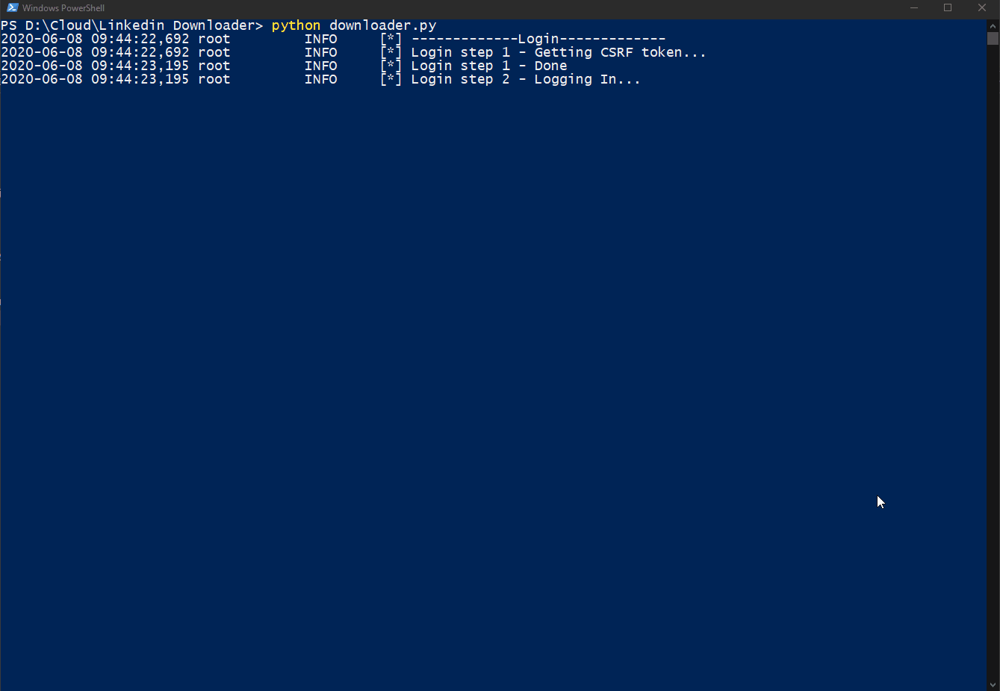
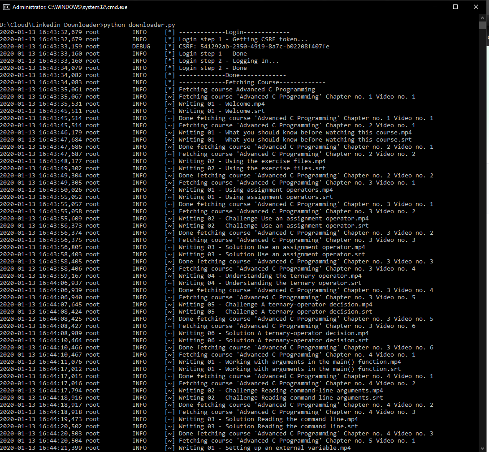
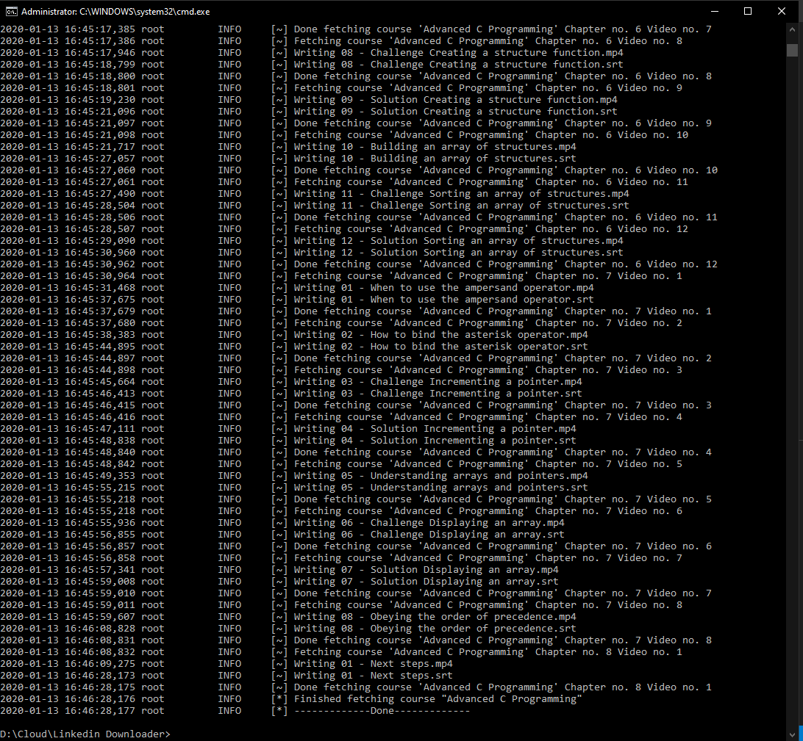

# linkedin-course-downloader
python script for downloading courses from linkedin learning with subtitles

# Based on liranbg's linkedin-learning-downloader But got restructured 

Dependencies:

Python 3
requests
lxml
clint

Please use this script for your own purposes.

This script was written for educational usage and personal use only.

Make sure your LinkedIn account is NOT protected with 2FA

# Installing dependencies:

`pip install -r requirements.txt`

# Open required_info.json put your  (linkedin email, password, and courses slugs or courses links)

it will be like this
`{
    "linkedin_email": "",
    "linkedin_password": "",
    "courses_links":
    ["https://www.linkedin.com/learning/learning-c-5", "learning-c-5"]
}`

e.g:
COURSE URL: https://www.linkedin.com/learning/python-advanced-design-pattern
->
SLUG: python-advanced-design-pattern

# Usage

`python downloader.py`

# Re-structued by Ahmed Soliman

